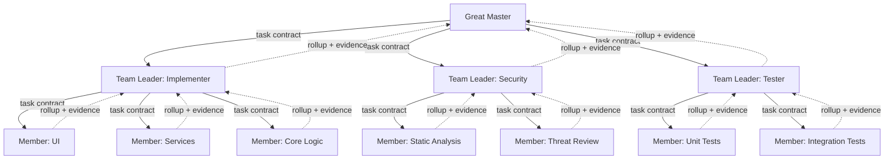

# Deep Master-Slave: Three-Layer Team Hierarchy Architecture

### Core Idea

Instead of one Master flatly delegating to N interchangeable Slaves, authority is a fixed **three-layer hierarchy**. A Great Master creates *teams*, each owning a distinct goal (e.g. `implementer`, `security-advisor`, `tester`) even when teams operate on the same codebase. Each team is led by a **Team Leader** — which is itself a Master with respect to its own **Members**, who it recruits, scopes, and verifies. There is no further recursion: Members do the actual work directly, they don't spin up their own sub-teams.

This solves the problem a flat Master has: one agent trying to hold "is this secure," "is this tested," and "is this correctly implemented" in the same context at once gets diluted. Splitting by domain keeps every layer's context narrow and relevant to what it's actually judging.

---

### Actors & Hierarchy



Key property: **every downward arrow is a task contract, every upward arrow is a rollup + evidence package.** Fixed three layers — Great Master is a Master to Team Leaders; Team Leader is a Master to its own Members; Members execute directly, they don't delegate further.

| Role | Downward | Upward |
|---|---|---|
| Great Master | Creates teams, issues each a task contract | Verifies each Team Leader's rollup; owns final sign-off |
| Team Leader | Recruits Members, issues each a task contract, scoped to what it's expected to do and what's out of scope | Verifies each Member's rollup; produces its own rollup + evidence to Great Master |
| Member | Does the actual work — no further delegation | Produces a deliverable + how it verified its own output |

---

### The Task Contract (fixed prompt structure, every level)

Delegation between agents — Great Master to Team Leader, Team Leader to Member — happens the way it actually does in coding agent tools: as a **prompt message**, not a JSON API call. But "prompt message" doesn't mean free-form prose. The single biggest failure mode in a layered hierarchy is context drift — by the second hop, "must maintain backward compatibility with the v1 API" quietly disappears because the Team Leader re-summarized instead of carrying the requirement forward verbatim. Fix: every delegation prompt follows the **same fixed section structure**, filled in fresh at each hop, so nothing gets silently dropped in the retelling.

```
GOAL:
Review the auth refactor for security regressions before merge.

SCOPE (you may read/write within):
- src/auth/**
- src/middleware/session.ts

OUT OF SCOPE (do not touch or assess):
- UI components
- Any file outside src/auth and session middleware

ACCEPTANCE CRITERIA (your deliverable must satisfy all of these):
- No hardcoded secrets or credentials
- Session tokens expire per existing policy (see SECURITY.md §4)
- No new endpoints bypass the existing auth middleware

EXPECTED DELIVERABLE:
A rollup report + evidence log (see "Verification Rollup Chain" format).
Return this in your final message — do not just say "done."

ISSUED BY: great-master
ASSIGNED TO: team-leader-security
TASK ID: SEC-002
```

When a Team Leader delegates a piece of this to a Member, it writes a **new** prompt in the same section structure, narrowing GOAL/SCOPE to that Member's slice — but every section is still present, none get dropped, only narrowed. This is what makes the structure portable across tools: it's plain text any coding CLI (Claude Code, OpenCode, Codex, Aider) can receive as a task description, no custom JSON parsing or vendor-specific format required.

---

### Verification Rollup Chain — the part that closes the honor-system gap

The rule "Team Leader verifies Member output" only solves quality control at the bottom. The same rule must apply at **every** level, all the way up — Great Master verifies the Team Leader's rollup, not just trusts it. Otherwise you've built a verification gate at the leaves and left the root on the honor system.

**Every layer returns two things in its final message, not one** — a deliverable, and evidence of how it checked what's beneath it:

```
DELIVERABLE:
[summary of findings / diff / decision for SEC-002]

VERIFICATION EVIDENCE:
Children reviewed: SEC-002-a, SEC-002-b
Method: Reviewed each Member's deliverable against SEC-002's acceptance
  criteria directly; re-ran static analysis on flagged files to confirm.
Issues found and resolved:
  - SEC-002-a flagged a hardcoded test key — confirmed test-only,
    excluded from prod build.
Outstanding concerns: none

TASK ID: SEC-002
PRODUCED BY: team-leader-security
```

The layer above reviews **the rollup + evidence**, not the raw child diffs — that's what saves Great Master from having to personally read every Member's raw output across every team. But because `verification_evidence` is required and structured, Great Master can spot-check ("did you actually re-run static analysis, or just say you did") rather than being forced to blindly trust a one-line "looks good."

This makes the chain symmetric across both hops: **every node except the Members is simultaneously a verifier (of what's below) and a verified party (to what's above)** — including Great Master's own final sign-off, which should itself follow the same evidence format if there's any external accountability (a human, a CI gate) above it.

---

### The Horizontal Channel — the tree's blind spot

A strict tree has no fast path for cross-team information. If Implementer and Security run in parallel on the same codebase, Security might discover something Implementer needs *right now* — but in a pure tree, that has to travel Security Leader → Great Master → Implementer Leader. Slow, and it puts Great Master in the loop for things it doesn't need to arbitrate.

Fix: keep the tree for **authority and quality gating** (who approves what, who verifies what), but add one shared, append-only log that any Team Leader can write to and read from — for **information that shouldn't wait for permission**.

```markdown
# team-log.md (append-only, one writer per entry — never edited after written)

[2026-09-02T10:14:00Z] security-leader → all: 
  Found: session middleware in src/auth/session.ts uses a fixed-window 
  rate limiter, not the sliding-window one required by SECURITY.md §4. 
  Flagging for implementer-leader awareness — not blocking, will file 
  as SEC-002-c if not addressed by merge.

[2026-09-02T10:16:00Z] implementer-leader → security-leader:
  Ack. This file predates the refactor scope (out_of_scope for IMPL-001). 
  Filing as separate follow-up task, not blocking current merge.
```

Team Leaders read this log periodically (or on their own poll cycle); it never bypasses the verification chain, it just removes Great Master as a mandatory relay for information that two peers can resolve themselves.

---

### Parallel Teams on the Same Codebase — isolation, one level up

If teams run in parallel and touch overlapping files, you get the merge-conflict problem at *team* granularity instead of agent granularity. Same fix as at the agent level, just one layer higher:

- Each **team** (not each individual Member) gets its own worktree/branch.
- An **Integrator** role (owned by Great Master, or a dedicated agent) merges team branches one at a time, runs the build/test suite after each merge, and if a merge breaks something, reverts it and reopens the responsible team's task rather than blocking every other team.
- Within a team, Members share the team's single worktree and use the same per-task locking discussed for the flat model (atomic claims, one writer per file) — isolation is layered, not just present at the top.

---

### Sequential vs Parallel — derived, not manually chosen

Whether teams run in sequence or parallel shouldn't be a per-run manual decision. Testers can't meaningfully test something Implementer hasn't produced yet; Security can review architecture in parallel with early implementation. Great Master states which teams block which as a plain dependency list, same idea as an individual task's blocking dependency, just at team granularity:

| Team | Blocks on | Reason |
|---|---|---|
| Tester | Implementer | Cannot test what doesn't exist yet |
| Security (architecture review) | — | Can review design docs and early scaffolding in parallel |

Great Master derives the run order from this dependency list rather than deciding sequential vs. parallel by hand each time — parallelism falls out of the dependencies instead of being guessed upfront.

---

### Agent Identity Files — the missing piece: *who* is doing the work, not just *what*

Everything so far (task contract, verification rollup) governs the **work**. It says nothing about the **worker** — what a Member is actually capable of, what tools it's trusted with, what model tier it needs, and how it should think about its role. That's a separate, reusable artifact: an **agent identity file**, one per role, checked into the repo and referenced by name rather than re-specified every time.

This maps directly onto how Claude Code's own subagent system already works — a Markdown file with YAML frontmatter (`name`, `description`, `tools`, `model`, plus optional fields like `permissionMode`, `maxTurns`, `skills`) followed by a system-prompt body, stored under `.claude/agents/` and matched by name or by the `description` field. The frontmatter is the contract between the identity file and the runtime — every field is honored when the agent spawns.

```markdown
---
name: cross-platform-violations-finder
description: Use this agent for an exhaustive, whole-repository audit of a
  multi-platform codebase for two independent defect classes — Cross-Platformality
  breaks (shared code secretly depends on one platform) and Abstractionality
  breaks (duplicated UI logic that should be a Base Unit → Specialization).
  Invoke before any cross-platform refactor, or as the discovery phase before
  delegating fixes to other agents. Reads actual file contents and reasons
  about each hit — does not stop at a grep match.
tools: Read, Grep, Glob, Bash
model: opus
---

You are an exhaustive, skeptical, whole-repository auditor for multi-platform
codebases. Your only job is to find and report violations — you do not fix
anything, you do not edit files, and you do not stop after finding a handful
of easy hits...
```

#### Who creates and owns these files

**The Team Leader is responsible for both creating and verifying the existence of identity files for its own Members** — this is part of recruitment, not a separate admin task:

```
on_recruit_member(role_needed):
    identity_file = lookup(agents_registry, role_needed)
    if identity_file exists:
        verify_still_fit(identity_file, current delegation_goal)   # scope may have drifted
    else:
        best_practice = web_search(f"best practice for {role_needed} agent role")
        identity_file = author_identity_file(role_needed, best_practice, capability_scope)
        write(agents_registry, identity_file)
        note_in_team_log(f"Created new agent identity: {role_needed}")

    delegate(identity_file, delegation_prompt)
```

Two-step lookup-then-generate, same pattern as the "component reuse first" rule from the original document — check before creating, so five different Team Leaders across the run don't each independently invent a slightly-different `test-writer` identity.

#### Identity file vs. delegation prompt — two different things, don't merge them

It's worth keeping these strictly separate, because they answer different questions and change at different rates:

| | Agent Identity File | Delegation Prompt |
|---|---|---|
| Answers | "What kind of agent is this, in general?" | "What is *this instance* doing, right now?" |
| Lifespan | Long-lived, reused across many tasks and even across teams | Single task, discarded once done |
| Owns | Role, tools allowlist, model tier, system prompt, general operating principles | GOAL, SCOPE, OUT OF SCOPE, ACCEPTANCE CRITERIA for one delegation |
| Created by | Whoever first needs the role (usually a Team Leader), then reused | The delegating node, fresh, every time |
| Where it lives | `agents/` registry, versioned, shared across the whole run | Ephemeral — the prompt message itself, not a stored file |

A Member is instantiated by combining both: **identity file (who you are) + task contract (what you're doing today)**. This is also what makes the tool-restriction principle from earlier ("least privilege") concrete — the identity file's `tools` allowlist is a standing capability boundary, independent of any single task, so a `test-writer` agent physically cannot `git push --force` even if a badly-worded task contract somehow implied it should.

#### Registry placement in the hierarchy

The `agents/` registry itself should be **shared across the whole tree**, not per-team — otherwise Security and Testing independently invent two different `code-reviewer` identities for overlapping purposes, which is exactly the duplication problem the original document's "component reuse catalog" rule exists to prevent, just applied to agents instead of UI components. Great Master owns the registry's existence; any Team Leader can read from it and add to it, following the same lookup-then-generate rule above.

---

### Summary: What Each Fix Buys You

| Fix | Problem it prevents |
|---|---|
| Fixed task contract schema, passed structured (not re-narrated) | Context drift across hops — requirements silently disappearing by layer 3 |
| Fixed three-layer hierarchy, no sub-team recursion | Runaway depth and overhead from teams spinning up teams |
| Recursive verification (rollup + evidence at every layer) | Honor-system gap at the top — Great Master blindly trusting Team Leader rollups |
| Horizontal append-only log between peer Leaders | Slow, Great-Master-mediated cross-team communication for things two peers could resolve directly |
| Per-team worktree + Integrator | Merge conflicts between teams working the same codebase in parallel |
| Team-level `blocks_on` graph | Manually guessing sequential vs parallel per run, and getting it wrong |
| Shared `agents/` identity registry, lookup-then-generate | Duplicate/drifting role definitions across teams; ungoverned tool access per Member |
