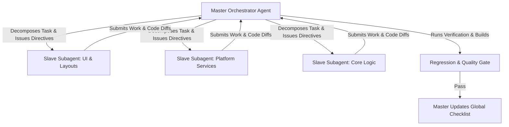

# Master-Slave Agent Orchestration Framework

### Executive Overview & Purpose
This document defines a general, project-agnostic engineering framework for orchestrating autonomous AI agent systems using a **Master-Slave (Orchestrator-Worker)** model.

The objective of this framework is to reliably execute large-scale, multi-stage software engineering tasks—such as full-codebase refactors, cross-platform migrations, and feature implementations—with zero visual regressions, strict architectural compliance, and complete accountability.

---

### Core Philosophy & Operational Principles



#### 1. Asymmetric Responsibility
- **Master** holds sole authority over planning, task decomposition, checklist progression, code review, and build validation.
- **Slaves** focus exclusively on localized, atomic implementation tasks within strictly defined boundaries.

#### 2. Grounded Truth Over Heuristic Guessing
- Slaves must never guess UI hierarchies, styles, or APIs. They are required to inspect explicit design artifacts (HTML/CSS mockups, Figma specs, architectural documentation) before writing code.

#### 3. Strict Quality & Verification Gates
- Work is not complete when a slave finishes writing code. Work is only complete when the Master reviews the diff, validates architectural compliance, runs target builds, and verifies zero regressions.

---

### Master Orchestrator: Roles & Responsibilities

The Master Agent acts as the technical lead, project manager, and quality assurance gatekeeper.

#### Key Responsibilities:
1. **Master Checklist Authority**:
   - Maintains and owns the global delivery checklist.
   - Slaves are strictly forbidden from checking off items; only the Master marks items completed after independent verification.
2. **Context Packaging & Task Isolation**:
   - Prepares self-contained task briefs for slaves, providing explicit file paths, design references, coding standards, and expected acceptance criteria.
   - Prevents context bleed by keeping subtasks focused and bounded.
3. **Architectural & Style Enforcement**:
   - Rejects any subagent diff that violates project architecture (e.g. leaking platform conditionals, duplicating existing components, bypassing designated design units).
   - Enforces cataloging rules (e.g. updating unit inventories whenever new reusable components are created).
4. **Target Compilation & Regression Testing**:
   - Executes target builds and test suites after every integration.
   - Immediately intervenes or assigns corrective subtasks if a build or test fails.

---

### Slave Subagents: Roles & Constraints

Slave Subagents (e.g. fast, capable models such as Gemini 3.7 Flash) act as focused execution units.

#### Operational Rules for Slaves:
1. **Inspect Artifacts First**:
   - Must open, read, and analyze design mockups, specification docs, and existing base units before authoring code.
2. **Component Reuse First**:
   - Must search the project's reusable component catalog before creating any new UI component or utility to avoid duplication.
3. **Atomic Scope Discipline**:
   - Modifies only the files assigned in the master's directive. Does not perform unprompted refactoring outside the assigned scope.
4. **Comprehensive Reporting**:
   - Returns a structured report to the Master detailing:
     - Exact files created, modified, or deleted.
     - Key design and technical decisions made.
     - Verification steps executed and output status.

---

### Standard Operating Workflow

#### Step 1: Planning & Checklist Formulation (Master)
- Master analyzes requirements and breaks them down into sequential, phased milestones with granular checklist items.

#### Step 2: Slave Task Delegation (Master ➔ Slave)
- Master constructs a directive prompt containing:
  - Exact objective and acceptance criteria.
  - Mandatory design mockups and steering documentation to consult.
  - Specific files to touch and components to reuse.
  - Verification commands to run.

#### Step 3: Autonomous Execution (Slave)
- Slave inspects references, implements the code changes, checks local code quality, and prepares the summary diff.

#### Step 4: Review & Validation Gate (Master)
- Master inspects the slave's changes against:
  - Visual and behavioral parity with mockups/specs.
  - Architectural cleanliness and non-duplication.
  - Target compilation and test pass status (0 errors, 0 warnings).

#### Step 5: Checklist Progression & Iteration
- If approved, Master marks the item done and moves to the next milestone.
- If rejected, Master provides corrective feedback and requests a targeted revision.

---

### Universal Checklist Template for Master Agents

```markdown
### Master Delivery Checklist

#### Phase 1: Foundations & Infrastructure
- [ ] Task 1.1: Core abstractions and platform interfaces established
- [ ] Task 1.2: Base navigation shell and routing configured
- [ ] Verification: Baseline compilation green (0 errors, 0 warnings)

#### Phase 2: Component & Screen Implementation
- [ ] Task 2.1: Primary view and layout barrels implemented
- [ ] Task 2.2: Secondary panels and interactive components integrated
- [ ] Verification: Visual parity verified against design mockups

#### Phase 3: Services & Background Handlers
- [ ] Task 3.1: Platform-specific service workers and notifications configured
- [ ] Task 3.2: Storage, caching, and security encryption wired
- [ ] Verification: Integration tests and clean target build verified

#### Phase 4: Final Quality Assurance & Documentation
- [ ] Task 4.1: Component catalog and steering docs updated
- [ ] Task 4.2: Full regression suite and smoke tests passed
```
