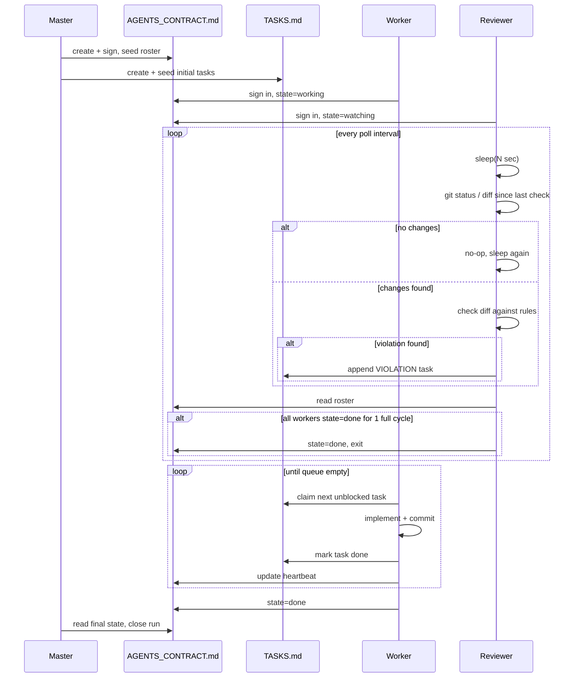

# Realtime-Reviewer / Pull-Queue Agent Architecture

### Core Idea

Two changes from the classic Master-Slave model:

1. **Review shifts from end-of-phase bulk to continuous, per-edit.** Instead of the Master reviewing a whole diff after a Slave finishes, a dedicated **Reviewer agent** watches the filesystem and checks every change *as it lands*, against a fixed rule set, with zero opinion beyond compliance ("no-op until it finds a violation").
2. **Work assignment shifts from static delegation to a pull queue.** Instead of "Slave 1 does UI, Slave 2 does Services," all tasks sit in one queue and any free Worker claims the next one. This removes idle time caused by uneven task sizing.

The two changes are complementary: the queue keeps Workers always busy, and the Reviewer catches violations the moment they're written instead of after a whole module is "done" — so a bad pattern gets caught and requeued as a fix *before* three more files copy it.

---

### Actors

| Actor | Role |
|---|---|
| **Master** | Plans the work, writes `TASKS.md` (initial task list) and `AGENTS_CONTRACT.md` (roster), resolves anything the Reviewer can't auto-resolve, declares the run finished. |
| **Worker** (N of these) | Signs into the contract, then loops: claim a task → do the work → commit → release → claim the next. Never touches review or the contract of other agents. |
| **Reviewer** (watchdog) | Sleeps, wakes on file change, diffs against the last reviewed state, checks the diff against the ruleset, writes a violation task if broken, goes back to sleep. Runs only while at least one Worker is signed in as `working`. |

---

### State Artifacts

#### `AGENTS_CONTRACT.md` — the liveness registry

This is what lets the Reviewer know whether to keep polling or exit. Master creates it; each Worker appends its own signed entry when it starts, and updates its own line when it changes state. **Nobody edits another agent's line.**

```markdown
# Agents Contract
Signed-by: master
Run-id: 2026-09-02-refactor-01

## Roster
| agent_id      | role        | state      | signed_at            | heartbeat_at          |
|---------------|-------------|------------|-----------------------|------------------------|
| worker-ui-01  | ui-slice    | working    | 2026-09-02T10:00:00Z | 2026-09-02T10:04:00Z  |
| worker-svc-01 | services    | working    | 2026-09-02T10:00:05Z | 2026-09-02T10:04:05Z  |
| worker-core-01| core-logic  | idle       | 2026-09-02T10:00:10Z | 2026-09-02T10:03:50Z  |
| reviewer-01   | reviewer    | watching   | 2026-09-02T10:00:15Z | 2026-09-02T10:04:20Z  |
```

- `state` ∈ `{working, idle, blocked, done, dead}`
- `heartbeat_at` is updated on every poll cycle, not just on state change — this is what tells the Reviewer "still alive" vs "crashed mid-task."
- The run ends when every non-reviewer row is `done` **and** stays `done` for one full poll cycle (avoids false termination if a Worker briefly goes idle between tasks).

#### `TASKS.md` — the pull queue

Master seeds this with the initial breakdown. Workers claim by editing their own task's line atomically (see Concurrency section). The Reviewer *appends* new tasks — it never edits existing ones.

```markdown
# Tasks
| id    | desc                             | status     | claimed_by     | blocks_on | source     |
|-------|----------------------------------|------------|-----------------|-----------|------------|
| T-001 | Implement nav shell               | done       | worker-ui-01    | -         | master     |
| T-002 | Wire auth service                 | in_progress| worker-svc-01   | -         | master     |
| T-003 | Migrate storage layer             | queued     | -               | T-002     | master     |
| T-004 | [VIOLATION] Duplicate button component in T-001 diff — reuse Button/ (see catalog §3) | queued | - | - | reviewer-01 |
```

- `status` ∈ `{queued, in_progress, done, blocked}`
- `blocks_on` lets Workers self-skip tasks that aren't ready — this is your dependency ordering, done without a central scheduler deciding it for them.
- Violation rows (`source: reviewer-01`) are just normal tasks with a tag — any free Worker can claim and fix one, not just the one who caused it. Master can optionally force-assign a violation back to its author.

---

### Lifecycle



---

### Worker Agent Instructions

This is not external code that runs the agent — it's the **instruction set given to the agent itself**, followed using its own Bash/Read/Edit tool calls within its normal agentic loop. The Worker executes this loop by repeatedly reading files, running `git` via Bash, and editing `TASKS.md`/`AGENTS_CONTRACT.md` — the same way it does any other multi-step task.

```
You are Worker <agent_id>, role: <role>.

1. Sign in: append your line to AGENTS_CONTRACT.md, state = "working".
2. Read TASKS.md. Find the first task that is "queued" and has no unresolved
   blocks_on.
3. Claim it (see Concurrency & Write Safety for how to do this without racing
   another Worker), set its status to "in_progress", claimed_by = your agent_id.
4. Do the work: read the files in that task's scope, make the changes, run
   any relevant tests.
5. Commit with a message referencing the task id.
6. Mark the task "done" in TASKS.md.
7. Update your heartbeat timestamp in AGENTS_CONTRACT.md.
8. If no unblocked task is available, set your state to "idle", wait a few
   seconds, and check again.
9. When there are no more tasks for your role and none pending on you,
   set your state to "done" and stop. Report what you completed in your
   final message.
```

### Reviewer Agent Instructions

Same principle — this is what the Reviewer's system prompt tells it to do, and it carries the loop out itself via Bash (`git status`, `git diff`) and Read, not via an external script polling on its behalf.

```
You are the Reviewer agent.

1. Sign in: mark yourself "watching" in AGENTS_CONTRACT.md.
2. Check `git diff` against the last commit you reviewed.
3. If nothing changed, wait a few seconds (e.g. 5s, per spec) and check again.
4. If something changed, read the changed files and check them against
   PRINCIPLES.md — no-op if compliant.
5. If you find a violation, append a new task to TASKS.md describing it,
   tagged with your agent_id as the source, so any free Worker can claim
   the fix.
6. Record the commit you just reviewed as your new checkpoint.
7. If every Worker in AGENTS_CONTRACT.md shows state "done" and this holds
   true across two consecutive checks (not just one — avoids missing a
   violation written right before shutdown), mark yourself "done" and stop.
8. Otherwise, go back to step 2.
```

---

### Concurrency & Write Safety — the part your description leaves implicit

Plain markdown files being edited concurrently by N processes **will corrupt** under real load — two Workers claiming a task in the same poll cycle both write "claimed" and you get a double-claim. Three fixes, cheapest first:

1. **Claim via atomic file operation, not text edit.** Use `mkdir tasks/T-003.claim/` or a filesystem rename — both are atomic at the OS level, unlike appending a line to a shared `.md`. The Worker that succeeds owns the task; the ones that fail move on. `TASKS.md` becomes a *rendered view*, regenerated from a `tasks/*.json` directory, not the source of truth itself.
2. **One writer per file.** Give every agent its own status file (`agents/worker-ui-01.json`) instead of one shared `AGENTS_CONTRACT.md` that everyone edits. The "contract" becomes the *directory listing* — Master/Reviewer read all files in `agents/`, nobody ever has two processes writing the same file.
3. **If you keep single shared files for human readability** (which is reasonable — `TASKS.md` as a dashboard), have exactly one process own writes to it (e.g., only Master or only the Reviewer regenerates it from the underlying per-agent/per-task source files), and everyone else writes to their own file.

Recommended: keep `AGENTS_CONTRACT.md` and `TASKS.md` as **human-readable, machine-regenerated views**; make `agents/*.json` and `tasks/*.json` the actual concurrency-safe source of truth underneath.

---

### Liveness, Heartbeats, and Termination

Your original description ("it needs to know if they are workers work now") is solved by the heartbeat field, but needs one more rule to be robust:

- **Dead vs idle vs done are different states.** A Worker that crashes mid-task looks identical to one that's just idle unless heartbeat has a timeout. Rule: if `now - heartbeat_at > TIMEOUT` and `state != done`, the Reviewer (or Master) marks that Worker `dead` and requeues its `in_progress` task back to `queued`.
- **Termination needs a debounce, not a single check.** If the Reviewer exits the instant it sees all Workers `done`, it can miss a violation written in the last few seconds before shutdown. Require `all done` to hold for **one full extra poll cycle** before the Reviewer signs off — this is step 7 in the Reviewer's instructions above.

---

### Why this beats bulk end-of-phase review

| | Master-Slave (bulk review) | This architecture |
|---|---|---|
| When violations are caught | After a Slave reports "done" — potentially after a whole module was built wrong | Within one poll interval of the offending edit |
| Idle time | Master idle while Slaves work; Slaves idle waiting for Master's review | Reviewer and Workers both continuously active |
| Task assignment | Static, decided upfront by Master | Dynamic — fast Workers naturally pull more tasks |
| Failure blast radius | Whole task/module redone if a late review finds a violation | One violation task, scoped to the specific change |
| Bottleneck | Master is a hard serial gate on every task | Master only intervenes on unresolved violations |

---

### Open Trade-offs to Decide On

- **Poll interval (`N` seconds)** — 5s matches your spec; tighter catches violations faster but burns more tokens/compute on no-op checks. Consider event-based triggering (`inotify`/filesystem watch) instead of `git status` polling if the environment supports it — same logic, no fixed sleep.
- **Who fixes a violation** — auto-requeue to any free Worker (fastest) vs force-reassign to the original author (better accountability, slower).
- **Reviewer authority ceiling** — this design has the Reviewer *flag*, never *block or revert*. If you want it to be able to halt a Worker mid-task on a severe violation, that's a step up in power that needs its own guardrail (e.g., only Master can authorize a hard stop).
