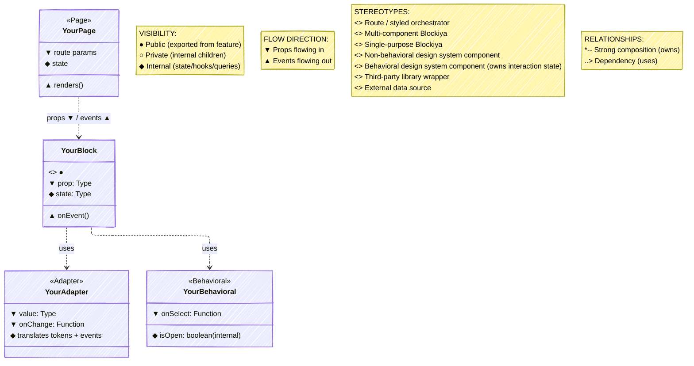
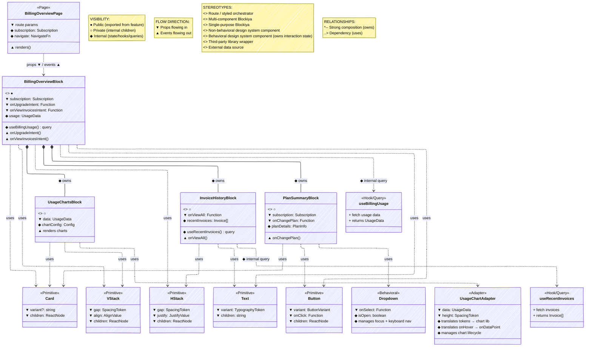

# Blockiya UML Notation System (Full)

Source: The Blockiya Pattern — UML Notation System + Diagram

## Notation system overview

### Core principles

1. **Minimal syntax** — use only essential markers
2. **Directional clarity** — arrows and symbols indicate flow direction
3. **Contextual visibility** — scope is relative to hierarchy level
4. **Standard base** — built on UML class diagrams for familiarity
5. **Tool agnostic** — works in Mermaid, PlantUML, or hand-drawn diagrams

### Notation categories

| Category | Purpose | Symbols |
| --- | --- | --- |
| **Stereotypes** | Classify block types | `<<Page>>`, `<<Compound>>`, `<<Atomic>>`, `<<Behavioral>>`, `<<Adapter>>`, `<<Utility>>`, `<<Feature>>`, `<<Primitive>>`, `<<Context>>`, `<<Hook/Query>>` |
| **Visibility** | Show export/scope level | `●`, `○`, `◆` |
| **Flow Direction** | Indicate data/event flow | `▼`, `▲` |
| **Relationships** | Show composition/usage | `*--`, `..>`, `⊙--`, `··>` |

## Block representation

### Standard block structure

Every Blockiya is represented as a UML class with four sections:

```
┌─────────────────────────────────────┐
│ <<Stereotype>> Visibility           │  ← Header: Type & Scope
│ BlockName                           │  ← Block Name
├─────────────────────────────────────┤
│ ▼ Props (Inflow):                   │  ← Section 1: Inputs
│   - prop1: Type                     │
│   - prop2: Type                     │
│   - onEvent: Function               │
├─────────────────────────────────────┤
│ ◆ Internal State:                   │  ← Section 2: Hidden State
│   - state1: Type                    │
│   - derivedValue: Type              │
│   - useQuery() hook                 │
├─────────────────────────────────────┤
│ ▲ Events (Outflow):                 │  ← Section 3: Outputs
│   - onEventName()                   │
│   - onAnotherEvent()                │
└─────────────────────────────────────┘
```

### Section breakdown

**Header** — stereotype (block classification) + visibility marker + block name.

**Props section (▼ Inflow)** — all props passed from parent, including type annotations. Callback props received as props are marked `▼` because they flow *into* the block.

**Internal section (◆ Hidden)** — local state (`useState`, `useReducer`), derived values (`useMemo`), internal query hooks, helper functions, context consumption. Never exposed in diagrams unless showing implementation detail.

**Events section (▲ Outflow)** — callback props *invoked* by this block, custom events emitted, navigation intents. The same callback that appears in `▼` as a received prop appears in `▲` when this block calls it.

### Minimal block (simple cases)

For simple blocks, omit empty sections:

```
┌─────────────────────────────────────┐
│ <<Primitive>>                       │
│ Button                              │
├─────────────────────────────────────┤
│ ▼ Props:                            │
│   - variant: ButtonVariant          │
│   - onClick: Function               │
│   - children: ReactNode             │
└─────────────────────────────────────┘
```

## Stereotypes (diagram guidance)

| Stereotype | Meaning | When to use | Example |
| --- | --- | --- | --- |
| `<<Page>>` | Top-level route component | Next.js / React Router pages | `BillingOverviewPage` |
| `<<Feature>>` | Large workflow orchestrator | Multi-step processes, wizards | `CheckoutWizardBlock` |
| `<<Compound>>` | Multi-component Blockiya | Combines 2–5 child blocks | `BillingOverviewBlock` |
| `<<Atomic>>` | Single-purpose Blockiya | Focused, leaf-level block | `UsageChartsBlock` |
| `<<Primitive>>` | Non-behavioral design system component | Visual tokens only, no interaction state | `Button`, `VStack`, `Text` |
| `<<Behavioral>>` | Behavioral design system component | Owns interaction state internally | `Dropdown`, `Modal`, `Tooltip` |
| `<<Adapter>>` | Third-party library wrapper | Wraps external tools, translates tokens and events | `CodeEditorAdapter`, `TerminalAdapter` |
| `<<Context>>` | Context object provider | State sharing across descendants | `ProjectContext` |
| `<<Hook/Query>>` | Data fetching hook | External data source | `useBillingUsage` |
| `<<Utility>>` | Pattern-native structural helper | If, useIntent, useDerive | `useIntent` |

### Stereotype guidelines

**`<<Page>>`** — always at the top of hierarchy diagrams. Handles routing, layout, and styled orchestration. Passes configuration down to feature blocks.

**`<<Feature>>`** — complex workflows (wizards, multi-step forms). Typically 5+ child blocks. May provide context to descendants.

**`<<Compound>>`** — the most common type. Orchestrates 2–5 child blocks. Pure composition logic.

**`<<Atomic>>`** — single responsibility. Few or no child blocks. Leaf nodes in hierarchy.

**`<<Primitive>>`** — pure visual tokens. No interaction model. Referenced via dependency (`..>`), never as main subjects. Part of the design system.

**`<<Behavioral>>`** — carries interaction complexity (open/close state, keyboard nav, focus trapping). Always uses compound component API shape. Owns its interaction state internally — callers never see `isOpen`. Referenced via dependency (`..>`).

**`<<Adapter>>`** — wraps a third-party library. Owns token translation, event translation, and lifecycle management. The Blockiya treats it like a primitive — mounts it, passes data, receives clean events back. The library's internals never reach the Blockiya.

**`<<Context>>`** — a context object provided by a parent Blockiya. Consumed by descendants via `useContext`. Use the `⊙--` / `··>` relationship symbols.

**`<<Hook/Query>>`** — data fetching hooks. Consumed internally by Blockiyas. Shown as a dependency when worth documenting.

**`<<Utility>>`** — pattern-native helpers. Referenced via `..>`.

## Visibility modifiers

Visibility is **contextual** and **relative** to the parent block.

| Symbol | Name | Meaning | Export location |
| --- | --- | --- | --- |
| `●` | Public | Exported from feature module | `features/billing/blockiyas/index.ts` |
| `○` | Private | Internal to parent Blockiya | `BillingOverviewBlock/children/` |
| `◆` | Internal | Implementation detail (state/hooks) | Never exported, runtime only |

### Contextual scoping rules

```
Feature Level:
  ● BillingOverviewBlock        (public — exported from feature)
    ○ UsageChartsBlock          (private — child of BillingOverview)
    ○ InvoiceHistoryBlock       (private — child of BillingOverview)

Another feature:
  ● ProjectEditorBlock          (public in projects feature)
    ○ ProjectFormFields         (private child)
    ● TaskListBlock             (public — reused across features)
```

A block can be public (`●`) at the feature level and private (`○`) relative to its parent. The same block may have different visibility in different contexts.

The `◆` internal marker covers: `useState`/`useReducer` state, `useMemo`/`useCallback` derived values, internal query hooks, helper functions, local variables. Never expose these in diagrams unless showing implementation detail.

## Flow direction markers

| Symbol | Direction | Meaning | Example |
| --- | --- | --- | --- |
| `▼` | Downward | Props/data flowing from parent to child | `subscription: Subscription` |
| `▲` | Upward | Events/callbacks flowing from child to parent | `onSaveIntent()` |

### The callback distinction

A callback prop like `onUpgradeIntent: Function` is marked `▼` because it **flows into** the block as a prop. The same callback invocation `onUpgradeIntent()` is marked `▲` because the **event flows out** when called.

- `▼` — what does this block receive?
- `▲` — what does this block emit/trigger?

```
┌─────────────────────────────────────┐
│ BillingOverviewBlock                │
├─────────────────────────────────────┤
│ ▼ Props (Inflow):                   │
│   - subscription: Subscription      │
│   - onUpgradeIntent: Function       │  ← received as prop (▼)
├─────────────────────────────────────┤
│ ◆ Internal:                         │
│   - usage: UsageData                │
├─────────────────────────────────────┤
│ ▲ Events (Outflow):                 │
│   - onUpgradeIntent()               │  ← this block calls it (▲)
│   - onViewInvoicesIntent()          │
└─────────────────────────────────────┘
```

## Relationships

| Symbol | Name | Meaning | When to use |
| --- | --- | --- | --- |
| `*--` | Composition | Strong ownership (parent creates/destroys child) | Direct JSX children |
| `..>` | Dependency | Uses/references (weak coupling) | Primitives, adapters, utilities |
| `⊙--` | Context Provision | Provides context to descendants | `Context.Provider` |
| `··>` | Context Consumption | Consumes context | `useContext` hook |

```
Parent *-- Child       : ◆ owns (composition)
Block  ..> Primitive   : uses (dependency)
Provider ⊙-- Context  : provides
Consumer ··> Context  : consumes
```

### Relationship annotations

```
BillingOverviewBlock *-- UsageChartsBlock    : ◆ owns, controls via props
BillingOverviewBlock ..> VStack              : uses for layout
BillingOverviewBlock ..> Dropdown            : uses (<<Behavioral>>)
BillingOverviewBlock ..> CodeEditorAdapter   : uses (<<Adapter>>)
ProjectEditorBlock ⊙-- ProjectContext       : provides shared state
FormFields ··> ProjectContext               : consumes for validation
```

## Complete notation reference card

```
┌─────────────────────────────────────────────────────────────┐
│                  BLOCKIYA UML NOTATION v2.0                 │
├─────────────────────────────────────────────────────────────┤
│ STEREOTYPES:                                                │
│   <<Page>>       Top-level route                            │
│   <<Feature>>    Large workflow orchestrator                │
│   <<Compound>>   Multi-component Blockiya                   │
│   <<Atomic>>     Single-purpose Blockiya                    │
│   <<Primitive>>  Non-behavioral design system component     │
│   <<Behavioral>> Behavioral design system component         │
│   <<Adapter>>    Third-party library wrapper                │
│   <<Utility>>    Pattern-native structural helper           │
│   <<Context>>    Context provider                           │
│   <<Hook/Query>> Data fetching hook                         │
├─────────────────────────────────────────────────────────────┤
│ VISIBILITY (contextual):                                    │
│   ●  Public      (exported from feature)                    │
│   ○  Private     (internal to parent)                       │
│   ◆  Internal    (state/hooks/implementation)               │
├─────────────────────────────────────────────────────────────┤
│ FLOW DIRECTION:                                             │
│   ▼  Props/Data  (flowing downward into block)              │
│   ▲  Events      (flowing upward out of block)              │
├─────────────────────────────────────────────────────────────┤
│ RELATIONSHIPS:                                              │
│   *--  Composition    (strong ownership)                    │
│   ..>  Dependency     (uses/references)                     │
│   ⊙--  Provides       (context provision)                   │
│   ··>  Consumes       (context consumption)                 │
└─────────────────────────────────────────────────────────────┘
```

## Diagram examples

### Example 1: Simple hierarchy

```
┌──────────────────────┐
│ <<Page>>             │
│ DashboardPage        │
└──────┬───────────────┘
       │ props ▼ / events ▲
       ▼
┌──────────────────────┐
│ <<Compound>> ●       │
│ DashboardBlock       │
├──────────────────────┤
│ ▼ userId: string     │
│ ▲ onRefresh()        │
└──────┬───────────────┘
       │
       ├─── *-- ○ StatsBlock    <<Atomic>>
       ├─── *-- ○ ActivityBlock <<Atomic>>
       └─── *-- ○ NotificationsBlock <<Atomic>>
```

### Example 2: Context object pattern

```
┌─────────────────────────────────────┐
│ <<Compound>> ●                      │
│ ProjectEditorBlock                  │
├─────────────────────────────────────┤
│ ▼ Props:                            │
│   - initialProject: Project         │
│   - onSaveIntent: Function          │
├─────────────────────────────────────┤
│ ◆ Internal:                         │
│   - project: Project                │
│   - errors: ValidationErrors        │
│   - isDirty: boolean                │
├─────────────────────────────────────┤
│ ⊙ Provides: ProjectContext          │
│   { project, updateProject,         │
│     errors, validate }              │
├─────────────────────────────────────┤
│ ▲ Events:                           │
│   - onSaveIntent(project)           │
└────────┬────────────────────────────┘
         │ ⊙ provides context
    ┌────┴────────┬──────────────┐
┌───────────┐ ┌────────────┐ ┌──────────┐
│ ○         │ │ ○          │ │ ○        │
│FormFields │ │Preview     │ │SaveCtrls │
│··> ctx    │ │··> ctx     │ │··> ctx   │
└───────────┘ └────────────┘ └──────────┘
```

### Example 3: Adapter in hierarchy

```
┌──────────────────────────┐
│ <<Compound>> ●           │
│ CodeEditorBlock          │
├──────────────────────────┤
│ ▼ fileId: string         │
│ ▼ onSaveIntent: Function │
├──────────────────────────┤
│ ◆ content: string        │
│ ◆ useFileContent() query │
├──────────────────────────┤
│ ▲ onSaveIntent(content)  │
└──────────┬───────────────┘
           │
           ├── ..> <<Adapter>> CodeEditorAdapter
           │         token translation (theme → CodeMirror)
           │         event translation (updateListener → onChange)
           │         lifecycle (mount, destroy)
           │
           └── ..> <<Primitive>> Box, Text
```

## Mermaid template (updated v2.0)



## Concrete diagram — BillingOverview (from original)



## Naming conventions

- Block names: use actual component names, include `Block` suffix — `BillingOverviewBlock`
- Adapter names: include `Adapter` suffix — `CodeEditorAdapter`, `TerminalAdapter`
- Props: use TypeScript types — `subscription: Subscription`
- Events: use `Intent` suffix — `onSaveIntent()`, `onUpgradeIntent()`
