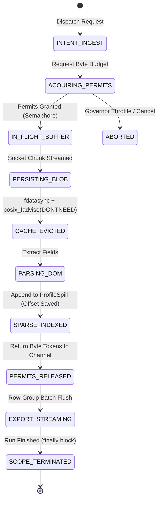
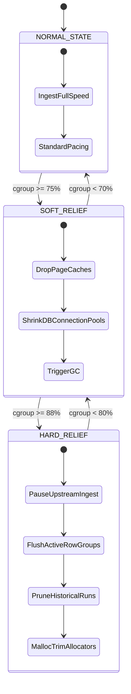

# Architecture Study: Memory-Bounded Scraper & Container Optimization

This reference document synthesizes the formal architecture study produced via the `search-deeply` multi-pass systems research methodology, evaluating the four mechanical clusters from `docs/MEMORY.md` across Python, Go, Node.js, and Rust.

---

## 1. Executive Summary

Containerized web data scrapers and stream ingestion services running on PaaS or container orchestration fabrics (Railway, Fly.io, Kubernetes, Cloud Run, ECS) with hard memory limits (512 MB to 1 GB) frequently crash with non-graceful OOM `SIGKILL` signals despite low reported process RSS. These failures stem from a structural misunderstanding of the Linux kernel memory controller: control groups (cgroups v1/v2) enforce memory ceilings on the aggregate sum of anonymous heap memory, kernel page cache (file-backed I/O), slab memory (dentries/inodes/sockets), and tmpfs. Monolithic writes, un-evicted raw HTML checkpoints, unbounded in-memory collection accumulation, multi-copy serialization pipelines, and unconstrained allocator arena fragmentation (such as glibc multi-arena scaling up to $8 \times N_{\text{cpu}}$) inevitably exhaust memory budgets.

The definitive architecture is the **Deterministic Layered Backpressure Pipeline with Out-of-Core Sparse Indexing and Autonomous Cgroup Governance**. This architecture enforces the universal invariant that resident memory must strictly equal $O(\text{concurrency})$, never $O(\text{dataset})$. Network streams are ingested in constant 64 KB chunks into byte-budgeted semaphore channels; heavy raw payloads are persisted once into a block-compressed append-only store of truth; subsequent parser and exporter phases operate on in-memory 64-bit sparse file offsets (`key -> offset, length`); intermediate files are unpinned from kernel page cache via `fdatasync` followed by `posix_fadvise(POSIX_FADV_DONTNEED)`; allocator arena growth is capped prior to process initialization via environment flags; and an autonomous background watchdog monitors `/sys/fs/cgroup/memory.current` to execute tiered soft (75%) and hard (88%) cache shedding and allocator trimming before the kernel OOM killer fires.

**Core Ownership Invariant:** An autonomous singleton `PipelineMemoryGovernor` owns container-level memory budgets by mediating byte-permit acquisition across ingest channels, while a run-scoped `SessionResourceManager` strictly owns the lifecycle of storage handles, disk-spill indexes, and streaming cursors, deterministically destroying all handles and issuing kernel page-cache eviction syscalls upon task termination.

---

## 2. The 4 Mechanical Clusters vs. Root Causes A1–A12

| Mechanical Cluster | MEMORY.md Codes | Generalized Systems Phenomenon | Root Vulnerability | Architecture Standard |
| :--- | :--- | :--- | :--- | :--- |
| **Cluster 1: Page-Cache & Storage I/O** | **A1, A2, A3, A4**, §1.3, §2.1, §2.2 | File-backed dirty/clean page cache accumulation charged to cgroup | Writing uncompressed raw payloads twice; unbounded run-over-run append loops; missing retention; unrotated logs | Single Store of Truth (SQLite+zstd); manifest-only checkpoints; proactive eviction via `fdatasync` + `posix_fadvise(DONTNEED)`; size-capped rotating logs |
| **Cluster 2: Heap & Live References** | **A5, A6, A7, A8, A9**, §1.1 | Unbounded live reference graphs; multi-copy serialization duplication; immortal resource pools | Accumulating parsed models in heap list; records -> dict -> DataFrame -> Parquet; unclosed DB connection pools; global state in modules; leaked log levels | Out-of-core sparse indexing (`ProfileSpill`); streaming row-group Parquet exports; deterministic run scopes (`finally` / `defer` / `Drop`); re-entrant telemetry guards |
| **Cluster 3: Allocators & Runtime Cgroups** | **A12**, §1.2, §2.4, §2.5 | Userspace memory allocator arena fragmentation; high-water heap top pinning | glibc multi-arena scaling ($8 \times N_{\text{cpu}}$); dynamic mmap threshold growth (up to 32 MB); swapless container reclaim stalls | Pre-configuring allocator flags in container image (`MALLOC_ARENA_MAX=2`, `GOMEMLIMIT`); autonomous cgroup watchdog governor |
| **Cluster 4: Backpressure & Streaming Transfers** | **A10, A11** | Discrete item-count queues ignoring payload variances; monolithic full-file I/O buffering | Sizing queues by item count ($N=200$) when item payloads vary from 2 KB to 20 MB; `file.read()` buffering gigabytes on download | Byte-budgeted semaphore channels (weighted token buckets); constant 64 KB chunked streaming I/O; direct zero-copy socket transfers |

---

## 3. Formal State Machines

### 3.1 Scraping Task Intent vs. Actual Runtime State

### 3.2 Autonomous Memory Governor State Machine

---

## 4. Complete Failure Modes Table

| Scenario / Code | Trigger Condition | Failure Mechanism | Observable Signature | Blast Radius | Hardened Architectural Defense |
| :--- | :--- | :--- | :--- | :--- | :--- |
| **Duplicate Raw Write (FM-1)** | Appending raw HTML to JSONL while also storing in SQLite (A1). | Monolithic file I/O locks clean and dirty pages in Linux page cache charged to container cgroup. | Checkpoint file reaches hundreds of MB; cgroup usage flatlines at 100% after run finishes. | Host container OOM kills upon subsequent run. | Enforce Single Store of Truth: raw HTML stored only once as zstd BLOB; checkpoints contain lightweight metadata manifests only. |
| **Unbounded Checkpoint Reuse (FM-2)** | Appending across runs via single checkpoint path without truncation (A2). | File size expands across days without reset, pinning cumulative page cache. | Checkpoint file size grows linearly run-over-run. | Gradual container instability and slow leak. | Enforce `CHECKPOINT_REUSE_MAX_BYTES` guard (128 MB threshold); treat existing files as read-only seeds. |
| **Historical Run Retention Failure (FM-3)** | Failure to delete historical run directories (A3). | Disk utilization climbs; dirty writeback queues stall; page cache retains unlinked file blocks. | Disk usage alarms; slow writeback delays. | Filesystem exhaustion; container OOM on allocation bursts. | Enforce run retention policy (`RUN_RETENTION=3`) and invoke `posix_fadvise(DONTNEED)` prior to unlinking directories. |
| **Unrotated Debug Log (FM-4)** | Logger level elevated to DEBUG without restoration (A4/A9). | Massive string generation into log appender, filling disk and page cache. | Server log grows to hundreds of megabytes. | Disk exhaustion; CPU starvation on log string formatting. | Re-entrant logger level token guard; `RotatingFileHandler(maxBytes=5MB, backupCount=2)`. |
| **Heap Accumulation in Results List (FM-5)** | Holding records in a heap `List` or `Array` across phases (A5). | Live reference graph prevents GC from freeing parsed objects; pointer chasing causes fragmentation. | RSS climbs linearly with processed records ($O(N)$); `gc.collect()` reclaims zero bytes. | Container OOM after 5,000–10,000 entities. | Out-of-core sparse indexing (`ProfileSpill`): append record to disk log; hold only 64-bit integer offset in RAM. |
| **Multi-Copy Serialization (FM-6)** | Materializing records -> dict -> DataFrame -> Parquet (A6). | Intermediate object representations create a $3\times$ to $5\times$ peak memory spike at export time. | Rapid vertical spike on container memory graph during final export phase. | Instant container OOM crash during export. | Direct streaming Parquet writer (`pq.ParquetWriter`) with bounded row groups (2,000 rows), bypassing DataFrames. |
| **Immortal Connection Caches (FM-7)** | SQLite connection pool with 64 MB cache per thread never closed (A7). | Thread-local connection handles maintain unevicted memory buffers indefinitely. | Staircase memory profile: memory steps up permanently after each scrape run. | Process crashes after 4–8 completed runs. | Cap SQLite cache at 8 MB (`PRAGMA cache_size = -8000`); enforce deterministic pool closure in `finally` / `defer`. |
| **Module-Level DataFrame (FM-8)** | Executing `df = load_data()` at module root on import (A8). | Dataset loaded into global memory during process bootstrap, surviving for entire server life. | Process baseline RSS starts at 150–300 MB before any scraping begins. | Reduces container headroom for scraping concurrency. | Lazy callable layout; memoized data accessors; streaming brace-depth counters for statistics. |
| **Full-File Buffered Transfer (FM-9)** | Serving downloads or uploads via `f.read()` or `await file.read()` (A10). | Kernel allocates contiguous virtual memory for full file payload, causing instant memory shock. | Vertical memory spike matching file size; instant container `SIGKILL`. | Immediate crash on user file download. | Stream file I/O in constant 64 KB chunks (`SafeFileResponse`); evict page cache immediately following transfer. |
| **Item-Count Channel Overflow (FM-10)** | Queue sized by item count (`maxsize=200`) with variable payloads (A11). | Discrete slots hold oversized payloads (e.g., 20 MB DOMs), accumulating gigabytes in-flight. | Unpredictable container crashes when scraping media-rich websites. | Transient worker OOM kills. | Byte-budgeted semaphore channels: track in-flight memory by bytes and suspend producers when budget fills. |
| **glibc Arena Fragmentation (FM-11)** | Allocating and freeing variable payloads across multithreaded workers (A12). | glibc creates up to $8 \times N_{\text{cpu}}$ arenas; top-of-heap allocations pin 64 MB sub-heaps. | Memory fails to drop after GC runs; `free` reports available memory. | Monotonic memory drift. | Pre-set `MALLOC_ARENA_MAX=2` and `MALLOC_MMAP_THRESHOLD_=131072` in container environment variables. |

---

## 5. Storage Engine Decision Matrix

| Storage Architecture | Memory Residency | Write Throughput | Checkpoint Resume Latency | Kernel Cache Overhead | Complexity | Scalability ($N > 10^7$) | Container Suitability (512 MB) | Recommended? |
| :--- | :--- | :--- | :--- | :--- | :--- | :--- | :--- | :--- |
| **In-Memory Heap List + JSON Export** | $O(N)$ Unbounded | High | None (Lost on Crash) | Extreme | Very Low | Catastrophic Fail | Unusable | **NO** |
| **Uncompressed JSONL Checkpoint** | $O(1)$ Heap, $O(N)$ Cache | Moderate | High (Full re-read) | Fatal (Page Cache Explosion) | Low | Fails at Flash Limit | Unusable | **NO** |
| **LSM-Tree (Pebble / RocksDB)** | $O(1)$ Flat | High | Low | Moderate (Block Cache) | High (Cgo / Native FFI) | Very High | Fair | **NO** (Overkill for single-node scrapers) |
| **DuckDB Embedded Columnar** | $O(1)$ Controlled | High | Low | Moderate | Moderate | High | Good (Requires tight RAM caps) | **NO** (Analytical focus) |
| **SQLite WAL + zstd + Sparse Spill (Ours)** | **$O(C)$ Strictly Flat** | **High (Compressed)** | **Instant (Indexed)** | **Minimal (`fadvise` Evicted)** | **Moderate** | **High** | **Optimal** | **YES (WINNER)** |

---

## 6. Progressive Practice Exercise

### Level 1: Diagnostic Profiling & Page Cache Leak Identification
- **Objective:** Differentiate between heap memory retention and OS page cache accumulation.
- **Requirements:** Run a script in a 512 MB Docker container (0 MB swap) writing 500 MB of JSON records to disk while appending objects to a list.
- **Verification:** Read `/sys/fs/cgroup/memory.current` vs process RSS. Observe that `gc.collect()` fails to drop cgroup usage until `posix_fadvise(POSIX_FADV_DONTNEED)` is called.

### Level 2: Implementing Byte-Budgeted Backpressure
- **Objective:** Construct a pipeline queue bounded by total payload bytes rather than discrete item count.
- **Requirements:** Implement a channel supporting variable payloads (5 KB to 25 MB) with a strict 30 MB aggregate ceiling.
- **Verification:** Ingest ten 10 MB payloads concurrently; verify that at most three items are buffered simultaneously and producers suspend asynchronously.

### Level 3: Out-of-Core Sparse Indexing & Streaming Export
- **Objective:** Implement the `ProfileSpill` sparse index architecture.
- **Requirements:** Ingest 100,000 JSON records. Persist raw payloads to disk while keeping only 64-bit integer offsets in RAM.
- **Verification:** Export the 100,000 records to Parquet via streaming row groups without materializing a DataFrame; verify that 4× data volume results in $\le 1.15\times$ peak memory.

### Level 4: Reactive Autonomous Memory Governor
- **Objective:** Build an autonomous cgroup watchdog thread with soft/hard threshold execution.
- **Requirements:** Sample `/sys/fs/cgroup` every 10 seconds. Implement soft tier (75%) cache drops and hard tier (88%) ingest throttling.
- **Verification:** Inject artificial memory pressure; confirm the governor relieves pressure, returns the container to baseline, and prevents OOM kill.
