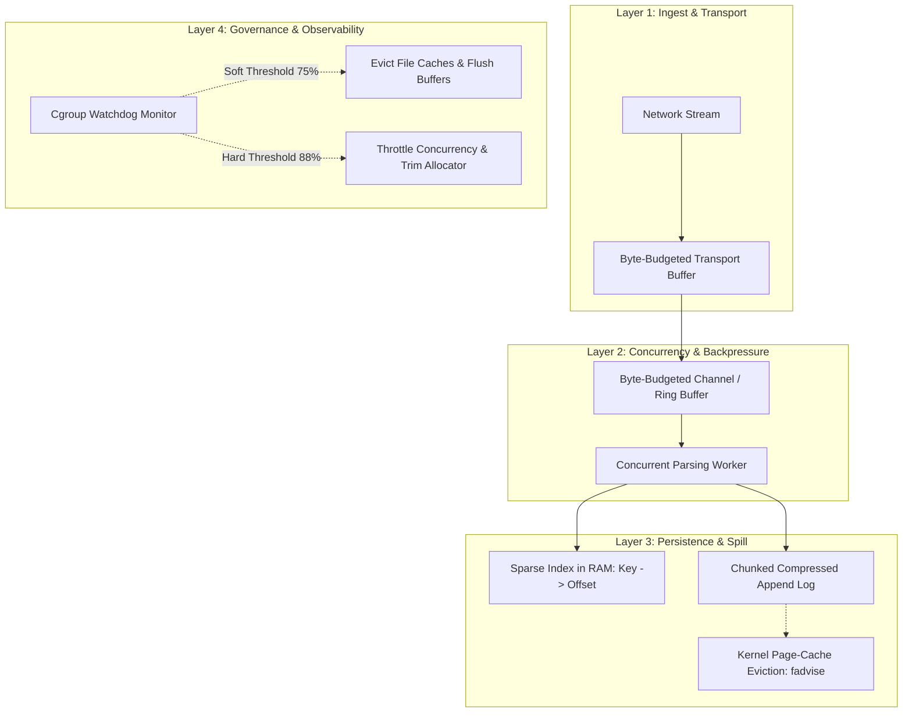

# Core Principles: Memory Bounds & The Layered Backpressure Pipeline

High-throughput scrapers and data ingestion pipelines routinely operate in memory-constrained container environments (e.g., Railway, Kubernetes, Fly.io with limits of 512 MB to 1 GB). When processing 100,000+ entities per run, architectures that naively accumulate data crash.

---

## 1. The Fundamental Law of Memory Invariance

$$\text{Memory Residency} = O(\text{Concurrency}), \quad \text{NOT } O(\text{Total Work Completed})$$

- **The $O(N)$ Anti-Pattern:** Storing records, URLs, or parsed models in heap collections (`List`, `Array`, `Map`, `DataFrame`). As the scraper ingests $N$ items, memory expands monotonically until SIGKILL occurs.
- **The $O(C)$ Invariant:** The maximum resident memory is strictly governed by the number of concurrent worker slots $C$ multiplied by the maximum allowed payload byte size $B_{\max}$. Total work $N$ can scale to billions of records with zero change in memory residency.

---

## 2. The Three-Layer Linux Cgroup Accounting Model

Conventional application profiling (such as `process.memory_info().rss` or language GC statistics) only measures heap allocations. In Linux container runtimes, the kernel enforces memory limits through **cgroups** (v1 `memory.limit_in_bytes` or v2 `memory.max`):

$$\text{memory.current} \approx \text{Anonymous Memory (Heap + Stack)} + \text{Page Cache (File-backed I/O)} + \text{Kernel Memory (Slab/Sockets)} + \text{Tmpfs}$$

```
+---------------------------------------------------------------------------------+
|                                cgroup memory.max                                |
|  [=========================== memory.current =================================] |
|  [ Anonymous Heap/Stack ] [ Tmpfs ] [ Kernel Slab ] [ Active/Inactive Cache  ]  |
|                                                     [   (File Page Cache)    ]  |
+---------------------------------------------------------------------------------+
```

### Why "Reclaimable" Page Cache Triggers OOM
A common misconception is that the kernel seamlessly drops page cache under pressure. Inside containers:
1. **Swap is disabled ($0\text{ MB}$ swap):** Container engines run with swap off, removing the safety valve for anonymous heap.
2. **Dirty pages cannot be evicted:** Pages written to disk that have not completed I/O writeback cannot be discarded.
3. **Synchronous reclaim bottleneck:** When workers stream network responses faster than throttled cloud block devices can complete writeback, synchronous page reclaim fails to keep pace, triggering an uncatchable container `SIGKILL`.

---

## 3. Byte-Budgeting vs. Item-Count Bounding

Pipelines commonly bound buffers using discrete item counts (e.g. `channel = Queue(maxsize=200)`). This is a critical structural vulnerability:

### The Variance Trap
In web data scraping, entity sizes vary across orders of magnitude:
- Minimal profile metadata: $\sim 2\text{ KB}$
- Single Page Application (SPA) DOM with inlined base64 images/SVGs: $\sim 20\text{ MB}$

$$200 \text{ items} \times 2\text{ KB} = 400\text{ KB (Completely Safe)}$$
$$200 \text{ items} \times 20\text{ MB} = 4.0\text{ GB (Instant Container OOM)}$$

### The Law of Byte-Weighted Backpressure
Queues and channels must track in-flight memory by **byte volume**:
$$\sum_{i=1}^{k} \text{PayloadBytes}(item_i) \le \text{MaxMemoryBudget}$$

Producers must acquire byte tokens from a shared semaphore or condition variable before enqueueing. If an item exceeds remaining budget, the producer suspends until consumers process and release permits.

---

## 4. The Layered Backpressure Pipeline Architecture

To guarantee bounded memory across all four operational dimensions, systems must implement four decoupled layers:



### Layer Responsibilities
1. **Layer 1: Ingest & Transport:** Fixed 64 KB chunk reads directly from sockets. Never read full response bodies into memory buffers.
2. **Layer 2: Concurrency & Backpressure:** Enforce in-flight bounds based on payload length using byte semaphores.
3. **Layer 3: Persistence & Spill:** Ingested payloads are compressed and persisted to a single store of truth. In-memory components retain only fixed-size 64-bit sparse file offsets.
4. **Layer 4: Governance & Observability:** Background watchdog continuously samples `/sys/fs/cgroup/memory.current` and triggers tiered, deterministic cache clearing and allocator trims before the OS kernel invokes the OOM killer.
