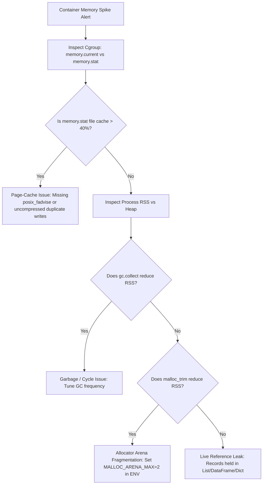

# Profiling & Verification: Relative Invariants & CI Assertions

Testing memory behavior in automated CI pipelines is notoriously difficult because absolute megabyte thresholds fail across different CPU architectures, OS kernels, and runner specs.

---

## 1. The Trap of Absolute Memory Thresholds

```python
# FRAGILE ANTI-PATTERN: Fails unpredictably in CI
def test_memory_usage():
    peak_mb = run_scraper(items=5000)
    assert peak_mb < 350.0  # Breaks on different CI runners, debug interpreters, or OS page sizes
```

Absolute assertions break because:
- Different Python / Node / Go / Rust minor versions have varying runtime baseline overheads.
- Cgroups vs VM environments measure memory with different accounting rules.
- Local developer workstations have 32 GB RAM; CI runners have 2 GB.

---

## 2. The Relative Scaling Invariant ($N$ vs. $4N$)

A well-architected pipeline maintains an $O(1)$ memory relationship to total dataset size. Therefore, scaling the test workload must not scale memory residency:

$$\frac{\text{PeakMemory}(4N)}{\text{PeakMemory}(N)} \approx 1.0 \quad (\text{Threshold: } < 1.3\times)$$

```python
# ROBUST RELATIVE ASSERTION
def test_memory_bounded_scaling():
    # Baseline run: 1,000 items
    baseline_peak = measure_peak_memory(workload_size=1_000)
    
    # 4x workload run: 4,000 items
    stress_peak = measure_peak_memory(workload_size=4_000)
    
    # 4x data volume must NOT result in linear (4x) memory growth
    ratio = stress_peak / baseline_peak
    assert ratio < 1.30, f"Memory scaled linearly with dataset size! Ratio: {ratio:.2f}"
```

If memory consumption scales with dataset size (ratio $\ge 2.0$), the test has caught an unbounded heap accumulation, item-count queue leak, or un-evicted page cache loop.

---

## 3. Storage & Payload Relative Assertions

In addition to heap measurement, verify storage isolation and manifest purity:

1. **Manifest Purity:**
   $$\text{Size}(\text{ManifestCheckpoint}) \ll \text{SingleHTMLPageSize}$$
   Assert that checkpoint files contain zero raw payload HTML strings and that manifest file size remains under 200 bytes per record.
2. **Spill Retention Ratio:**
   $$\frac{\text{In-Memory Sparse Index Bytes}}{\text{On-Disk Payload Bytes}} < 0.05 \quad (< 5\%)$$
   Assert that in-memory structures store only lightweight keys and byte offsets.

---

## 4. Triage Playbook: Live References vs. Allocator Fragmentation vs. Page Cache

When memory climbs in production, determine the root cause layer using this triage flow:


