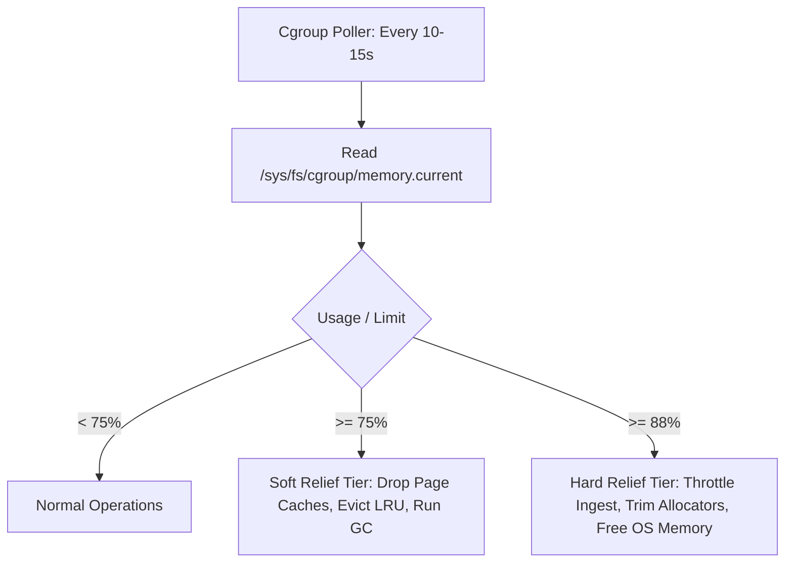

# Runtime Tuning: Container Physics, Allocators, & Cgroup Governance

Understanding how container engines allocate, account for, and reclaim memory is critical to operating high-throughput scrapers without crashing.

---

## 1. Cgroup Accounting: V1 vs. V2 Mechanics

In Linux environments (Railway, Docker, Kubernetes, Fly.io), memory isolation is governed by control groups.

### Metric Paths

| Metric | Cgroup v1 (`/sys/fs/cgroup/memory/`) | Cgroup v2 (`/sys/fs/cgroup/`) |
| :--- | :--- | :--- |
| **Current Charged Usage** | `memory.usage_in_bytes` | `memory.current` |
| **Hard Memory Ceiling** | `memory.limit_in_bytes` | `memory.max` |
| **High Watermark / Throttle** | N/A | `memory.high` |
| **Page-Cache Breakdown** | `memory.stat` (`total_cache`) | `memory.stat` (`file`) |
| **OOM Event Counters** | `memory.failcnt` / `memory.oom_control` | `memory.events` (`oom_kill`) |

### The Kernel Charging Formula
$$\text{Charged Usage} = \text{Anon (Heap/Stack)} + \text{File (Page Cache)} + \text{Tmpfs} + \text{Kernel Memory (Slab/Sockets)}$$

Every byte written to a file remains in the page cache until the kernel reclaims it or the process issues an explicit eviction syscall.

---

## 2. Allocator Internals & The Arena Fragmentation Trap

Even when application runtimes (CPython, Node.js, Go) deallocate objects, memory often remains trapped within userspace memory allocators:

### glibc malloc (`ptmalloc3`) Mechanics
1. **Multi-Arena Scaling:** Creates up to $8 \times N_{\text{cpu}}$ independent memory arenas on 64-bit systems to eliminate thread lock contention. An 8-core host provisioned for a 1 GB container can instantiate 64 separate arenas.
2. **Top-Heap Pinning:** Each arena allocates sub-heaps via `mmap`. If a single 64-byte object remains live at the top address of a 64 MB arena sub-heap, the entire 64 MB cannot be returned to the OS via `munmap` or `sbrk`.
3. **Dynamic Threshold Drift:** glibc defaults to a 128 KB `M_MMAP_THRESHOLD`. As multi-megabyte payloads are allocated and freed, glibc dynamically increases `M_MMAP_THRESHOLD` up to 32 MB. Subsequent large allocations shift onto the fragmented heap rather than using clean `mmap/munmap`.
4. **Startup Initialization Rule:** `mallopt()` calls from application code (e.g., Python `ctypes`) execute **after** glibc has already initialized its arenas. Capping **must** be declared via environment variables before process start:
   ```bash
   ENV MALLOC_ARENA_MAX="2" \
       MALLOC_MMAP_THRESHOLD_="131072" \
       MALLOC_TRIM_THRESHOLD_="131072"
   ```

### Modern Alternative Allocators
- **jemalloc:** Bin-based size classes with dirty decay intervals. In constrained environments, configure eager page return:
  `MALLOC_CONF="background_thread:true,dirty_decay_ms:0,muzzy_decay_ms:0"`
- **mimalloc:** Segment-based free-lists with rapid page reuse and minimal fragmentation.
- **Go Scavenger:** Go 1.19+ supports `runtime/debug.SetMemoryLimit` (or `GOMEMLIMIT=800MiB`), which activates aggressive GC pacing and issues `madvise(MADV_DONTNEED)` before cgroup limits are breached.
- **Node.js (V8):** Configure `--max-old-space-size=700 --optimize-for-size`. Note that off-heap `Buffer` allocations are outside V8's heap and require explicit GC awareness.

---

## 3. Kernel Page-Cache Eviction: `posix_fadvise` vs. `sync_file_range`

To prevent massive file operations (downloads, uploads, SQLite checkpoints) from consuming all available container cgroup budget:

```
[Userspace Write] ---> [Dirty Page in Cache]
                               │
                fdatasync() or sync_file_range()
                               │
                               ▼
                      [Clean Page in Cache]
                               │
                 posix_fadvise(POSIX_FADV_DONTNEED)
                               │
                               ▼
               [Page Dropped from Container Cgroup]
```

### The Silent Failure Trap
Calling `posix_fadvise(fd, offset, len, POSIX_FADV_DONTNEED)` on a **dirty** page is a **silent no-op**: the Linux kernel will not evict unwritten bytes. You must invoke `fdatasync()` or `fsync()` immediately prior to calling `posix_fadvise()`.

```python
import os, sys

def drop_file_cache(file_path: str) -> None:
    if not sys.platform.startswith("linux"):
        return
    try:
        fd = os.open(file_path, os.O_RDONLY)
        try:
            try:
                os.fdatasync(fd)
            except OSError:
                pass
            os.posix_fadvise(fd, 0, 0, os.POSIX_FADV_DONTNEED)
        finally:
            os.close(fd)
    except Exception:
        pass
```

---

## 4. The Multi-Tier Reactive Memory Governor

While proactive streaming prevents memory accumulation, edge cases (unusually large pages, sudden network bursts) require a reactive safety net:

### Tiered Response Thresholds



1. **Soft Threshold (75% of Limit):**
   - Invalidate clean page caches (`drop_dir_cache` / `posix_fadvise`).
   - Run runtime garbage collection (`gc.collect()` / `runtime.GC()`).
   - Shrink internal database connection caches (e.g., SQLite `PRAGMA shrink_memory`).
2. **Hard Threshold (88% of Limit):**
   - Temporarily pause network ingestion channels.
   - Enforce immediate retention cleanup: delete historical run directories.
   - Release allocator arenas to OS (`malloc_trim(0)` in glibc, `debug.FreeOSMemory()` in Go).
