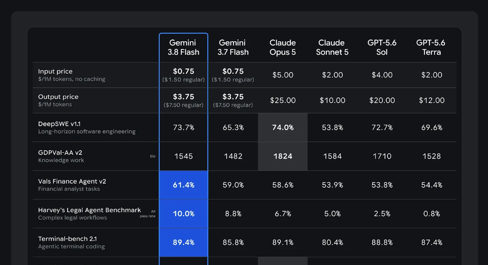

# Semantics and Intent

Covers: timestamps and temporal data, data representation and labels, what the visualization is trying to communicate, data focus, field semantics and descriptions.

These are a mix of **global** (timestamp conventions, field semantics) and **chart-specific** (focus, purpose) decisions.

---

## Timestamps and temporal data

If the data has timestamps, pin down before building anything:

- What format — Unix time, ISO 8601, something else?
- Timezone-aware or naive? UTC or local?
- Should it be converted for display, and to what?

The same instant can be shown many ways depending on context — `2024-03-12T14:32:21Z` could become `March 12, 2024`, `2 years ago`, or `14:32`. Decide:
- Should dates be humanized (relative time) or shown absolutely?
- Should the raw/precise timestamp remain accessible (e.g. in a tooltip) even if the display is humanized?
- What precision does the audience actually need — day, hour, second?

## Data representation and labels

A raw value and its *meaning* aren't the same thing, and the visualization should reflect meaning, not just the primitive type:

- `0.85` might stay `0.85`, or become `85%`, or become a categorical label like `High` — depending on what the field actually represents.
- `1700000000` might be a plain number, or it might be a Unix timestamp that needs converting before it means anything to a viewer.

Ask, per field:
- Should this stay numeric, or be formatted (currency symbol, `%`, compact notation like `1.2M`)?
- Would a numeric range communicate better as a bucketed label (`Low` / `Medium` / `High`) than as a raw number?
- Does this field need domain knowledge to interpret correctly, and if so, is that knowledge captured anywhere the visualization can use it?

### Precision, explicitly

Decimal precision is part of formatting, not an afterthought — `48.830000000001` showing up in a tooltip because a value was never rounded is a common, avoidable failure. Decide it deliberately rather than inheriting whatever the source data happens to contain:

- Is one precision rule applied dashboard-wide, or does it vary by field because the fields represent genuinely different scales (currency to the cent, percentages to one decimal, raw counts as whole numbers, a score out of 100 to one decimal)?
- Does display precision match calculation precision, or is a value computed at full precision and only *rounded for display* (the safer default — round late, not early, so aggregates aren't compounding already-rounded numbers)?
- Step 1's data inspection reports the decimal precision actually observed per numeric field — start from that rather than guessing a rounding rule that doesn't match what the data actually contains.

## What is the data trying to communicate?

Before picking a chart, name the question being answered. The same dataset can require a completely different chart depending on which of these it's serving:

- comparison · ranking · trend · distribution · proportion · relationship / correlation · composition · hierarchy · progression · state transition · geographic distribution · time-series behavior

This single question ("what are we trying to show?") is usually the fastest way to rule out a wrong chart choice — see `03-choosing-and-transforming.md` for how purpose maps to chart type.

## Data focus

Focus means deliberately making one entity, category, or value more prominent than the rest — the "compare this one thing against everything else" pattern. It's a **chart-specific** decision: does *this* chart have a target?

If yes, focus can be achieved through several combinable techniques:
- **Ordering** — put the target first, so it's encountered before anything else.
- **Spatial position** — a dedicated, consistently-placed column/row/area.
- **Highlighting / contrast** — visually distinguishing the target's cells or points from the rest.
- **Conditional formatting** — color-coding outcomes rather than just marking the target.
- **De-emphasis of unrelated data** — making the *non-target* data recede rather than only making the target pop.

Decide explicitly:
- Is there one target entity, or several?
- Should the target's position be fixed (always first) or can the user change what's focused?
- Does every row/metric get a winner-highlight, or only some (see below — not every metric is a "pick a winner" metric)?

### Worked example

If a data-focus decision is in play, open `assets/data-focus-example.png` with the `view` tool and actually look at it — the pattern below is much faster to absorb from the image than from the description of it. It's a benchmark comparison table across six AI models, with one model as the target:

- The target sits in the first column with a **persistent border** around the whole column — constant regardless of how any individual row turns out.
- **Every row still highlights whichever value actually wins that row**, even when the target didn't win it. This is the part that's easy to skip and shouldn't be: a focus pattern that only ever flags the target's wins isn't focus, it's cherry-picking, and it costs the reader's trust the moment they notice a row where the target clearly lost with no acknowledgment.
- **Color, not the fill itself, is what carries "focus."** When the target wins a row, that cell fills with the target's accent color (matching the column border, so it reads as "the target's win"). When a competitor wins, that cell gets the identical bold/filled treatment but in a neutral color (e.g. gray) — the true leader stays legible either way; only the target's wins get the brand-colored payoff.
- Rows that aren't really "pick a winner" metrics (e.g. price, where the comparison isn't a simple higher-is-better ranking) skip the winner-fill treatment entirely and just bold the target's own value. Not every row needs win/lose treatment — only apply it where "which value is best" is actually the point of that row.

This is the line between **emphasis** (the target is easy to find) and **distortion** (the target is made to look better than it actually did). Good data-focus design always does the former and never the latter — if a highlight scheme would require hiding or downplaying a row the target lost, that's a sign the scheme has crossed into distortion.

## Field semantics and descriptions

Don't assume a field name fully explains a field's meaning. `pricing_plan: 1.5` isn't self-explanatory without knowing `pricing_plan_type` and how the two relate — and some values are only interpretable in combination with other fields on the same record.

- Does the source provide metadata/descriptions for fields, or does that need to be authored?
- Can multiple fields jointly define a value's meaning, and if so, is that relationship documented somewhere reachable (even if only in a tooltip)?
- Should that context be shown directly and always-visible, or surfaced only on interaction (hover/click)?

Where a field's meaning genuinely isn't recoverable from the name alone, treat writing a short description as part of the visualization work, not an afterthought — an unlabeled or ambiguous axis/column undermines trust in the whole chart even when the underlying data is correct.
